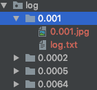
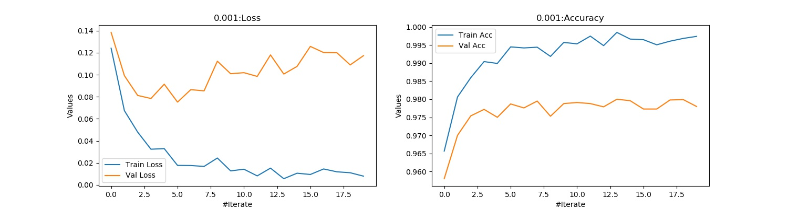
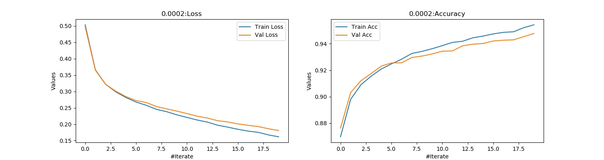
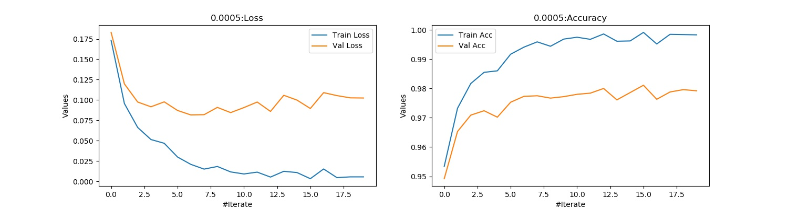

# SearchingParameters

我们知道在现代深度学习,我们对于超级参数的搜索方式采用的是[Random Search for Hyper-Parameter Optimization](http://www.jmlr.org/papers/volume13/bergstra12a/bergstra12a.pdf)即随机搜索的方式.

## 1. Create Searching

我们主要采用Python中的多进程模式(Master-Works)模式,主要步骤如下所示:

**Note:**我们这里针对学习率(lr)进行超级参数的搜索,设置的搜索范围为[0.0001,0.01]即[-4,-2].

[1] Crate Master

```python
def Master(*args):
    """
    Note: 我们这里的随机采取最好是偶数个,因为多进程如果是奇数个的话效率会很慢.
    """
    for _ in range(4):
        r = np.random.uniform(search_start,search_end)
        q.put(r)
```

该函数主要控制我们的随机生成的```lr```参数,通过```random.uniform()```进行随机均匀的抽取.然后使用```q.put(r)```放入队列中等待Workers获取.

[2] Create Master

```python
def Workers(*args):
		"""
		Processing of Works.Complete running model at Master given learning rate.
		"""
    while 1:
        print('Process:{} Start!'.format(os.getpid()))
        lr = np.round(np.power(10,q.get()),4)
        print('Process:{} trying lr:{}'.format(os.getpid(),lr))
        losses, val_losses, acc_trains, acc_vals, parameters,SON_PATH = Softmax_Model(layers, x_train, y_train, x_test, y_test,lr=lr,epochs=20,beta_1=0.9,beta_2=0.999,batc_size=64,save_path=save_path,lock=lock)
        plot_path = SON_PATH + str(lr) + '.jpg'
        Save_plot(losses,val_losses,acc_trains,acc_vals,plot_path,lr)

        if q.empty():
            print('Process:{} Over!'.format(os.getpid()))
            break
```

该函数主要用于运行Softmax函数,得到相应train/validation的loss/accuracy.

每次从队列```q.get()```中拿到随机产生的学习率,放入Softmax_Model函数中,然后再绘制Loss/Accuracy存入本地.如果队列为空```q.empty()```说明Master已经不再产生随机的学习率(lr),进而退出子进程.

[3] Start Processing

```python
lock = RLock()
q = Queue()
p1 = Process(target=Master,args=(q,search_start,search_end))
p2 = Process(target=Workers,args=(q,layers, x_train, y_train, x_test,y_test,save_path,lock))
p3 = Process(target=Workers,args=(q,layers, x_train, y_train, x_test,y_test,save_path,lock))

p1.start()
p2.start()
p3.start()

p1.join()
p2.join()
p3.join()
```

(3.1) 由于我们需要将Softmax_Model函数中的loss/accuracy写入本地```WRITE = '[{}/{}] loss:{:.4f},acc_train:{:.4f}…```所以我们需要创建进程锁```RLock()```,当然对于多进程而言,我们可以不创建进程锁,但是为了安全起见我们这里还是使用.

(3.2) 接着,我们创建三个进程分为为:

- p1:主进程,用于生产随机学习率```lr```.
- p2:子进程,依照主进程给予的学习率训练模型,并将每一次迭代```epochs=20```的loss/accuracy写入本地,以及将最红绘制的loss/accuracy写入本地,便于我们后面分析.
- P3:子进程,功能与p2相同.

(3.3) 接着启动三个进程```p1.start(),p2.start(),p3.start()```.并且需要注意的是我们需要将使用进程等待(阻塞)保证所有进程能够完成自己的任务```.join()```.


## 2. 效果

[1] Log dir



执行完毕了之后目录的结果,子文件夹为学习率的大小,三级目录包含:

- 1.0.001.jpg,绘制的loss/accuracy 

  > 

- 2.log.txt,为Softmax_Model每个epochs产生的结果.

  > ```
  > [1/20] loss:0.1241,acc_train:0.9657,val_loss:0.1385,acc_val:0.9580
  > [2/20] loss:0.0674,acc_train:0.9806,val_loss:0.0992,acc_val:0.9700
  > [3/20] loss:0.0479,acc_train:0.9860,val_loss:0.0812,acc_val:0.9754
  > [4/20] loss:0.0324,acc_train:0.9904,val_loss:0.0785,acc_val:0.9772
  > [5/20] loss:0.0330,acc_train:0.9899,val_loss:0.0915,acc_val:0.9750
  > [6/20] loss:0.0177,acc_train:0.9945,val_loss:0.0752,acc_val:0.9787
  > [7/20] loss:0.0176,acc_train:0.9942,val_loss:0.0865,acc_val:0.9776
  > [8/20] loss:0.0168,acc_train:0.9944,val_loss:0.0854,acc_val:0.9795
  > [9/20] loss:0.0244,acc_train:0.9919,val_loss:0.1123,acc_val:0.9753
  > [10/20] loss:0.0127,acc_train:0.9957,val_loss:0.1009,acc_val:0.9788
  > [11/20] loss:0.0143,acc_train:0.9953,val_loss:0.1019,acc_val:0.9791
  > [12/20] loss:0.0082,acc_train:0.9975,val_loss:0.0985,acc_val:0.9788
  > [13/20] loss:0.0152,acc_train:0.9949,val_loss:0.1180,acc_val:0.9779
  > [14/20] loss:0.0056,acc_train:0.9985,val_loss:0.1007,acc_val:0.9800
  > [15/20] loss:0.0106,acc_train:0.9967,val_loss:0.1076,acc_val:0.9796
  > [16/20] loss:0.0095,acc_train:0.9965,val_loss:0.1258,acc_val:0.9773
  > [17/20] loss:0.0145,acc_train:0.9951,val_loss:0.1202,acc_val:0.9773
  > [18/20] loss:0.0119,acc_train:0.9961,val_loss:0.1200,acc_val:0.9798
  > [19/20] loss:0.0111,acc_train:0.9969,val_loss:0.1090,acc_val:0.9799
  > [20/20] loss:0.0080,acc_train:0.9974,val_loss:0.1174,acc_val:0.9780
  > ```

[2] 结果

通过比较,在4次随机选择的学习率情况下:

- 效果最好的是```lr=0.002```,train acc = 0.9544,val acc=0.9478.没有发生严重的过拟合.

  > 

- 正确率最高的是```lr=0.0005```,train acc = 0.9983,val acc=0.9792,但是已经发生了过拟合的现象,且波动较大.

  >


## 3. Summary

由于电脑性能原因,我这里就不做更多的参数搜索,通过多进程的模式,能够使得我们的参数搜索更加的高效.

