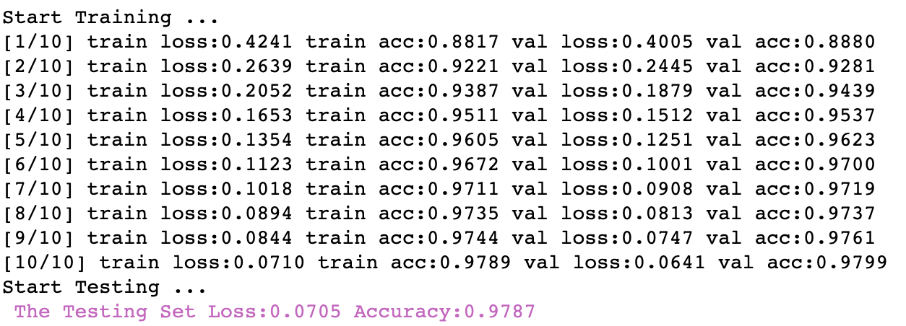

<figure class="third">
    
</figure>

# LeNet-5

You need to view the original paper of [LeNet-5](http://vision.stanford.edu/cs598_spring07/papers/Lecun98.pdf).

In this code, LeNet-5 implementation of three methods and Theory by [LeNet-5(Theroy)](LeNet-5(Theory).ipynb):

1.Tensorflow: Implementation of [LeNet-5(tensorflow)](LeNet-5(Tensorflow).ipynb)

> 

2.Pytorch: Implmentation of [LeNet-5(pytorch)](LeNet-5(Pytorch).ipynb)

> ​	

3.Keras: Implmentation of [LeNet-5(Keras)][]

> ​	

