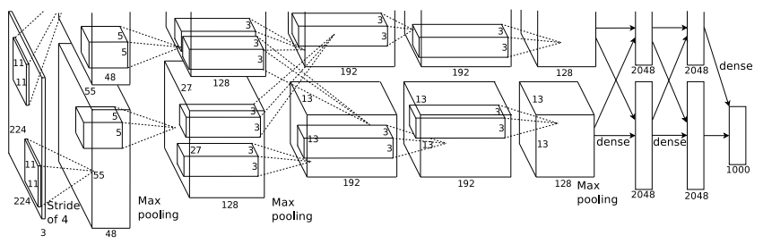
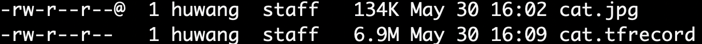
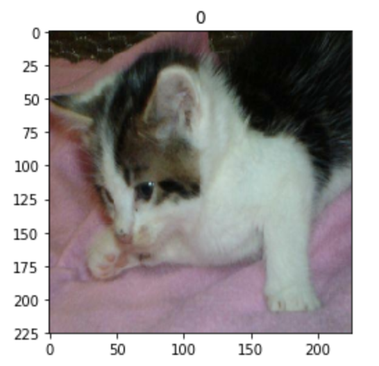
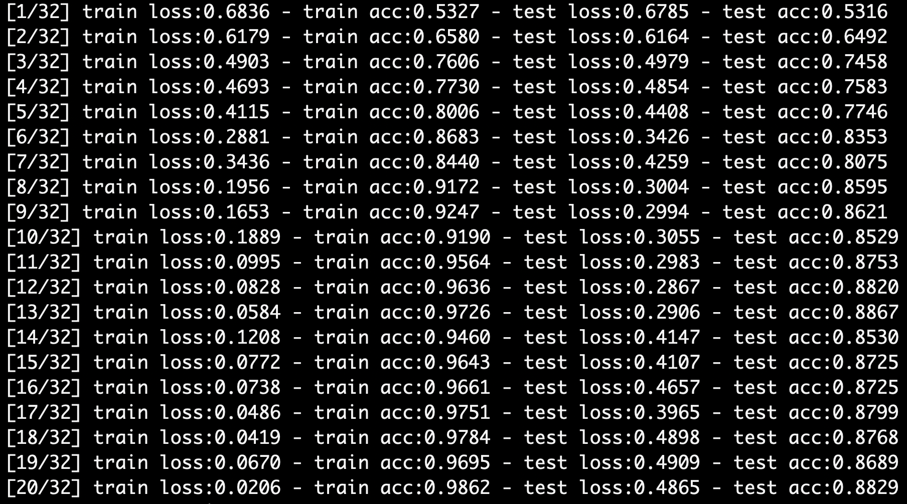
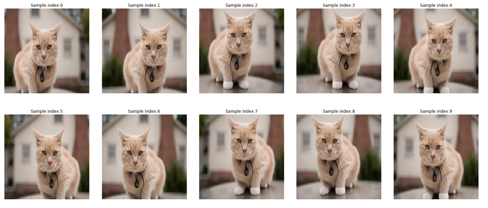
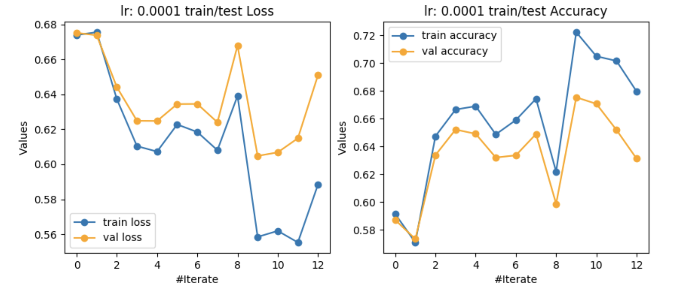
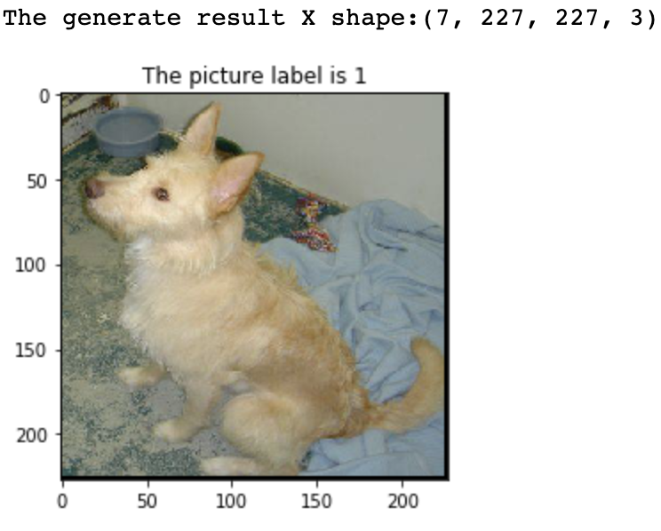
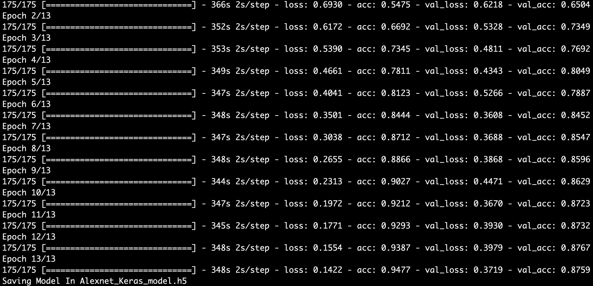

<figure class="third">
    
</figure>

# AlexNet

You need to view the original paper of [AlexNet](https://papers.nips.cc/paper/4824-imagenet-classification-with-deep-convolutional-neural-networks.pdf).

In AlexNet, have three implementations of methods:

You can view AlexNet(Theory)  to understanding AlexNet.

**Tensorflow**:

The code in this directory  AlexNet-Tensorflow

This directory has three directories:

(1) TFRecord

this cell tells what is TFRecord and tell you how to build Google cloud:

> 

(2) Load Data set

this cell tells you how to load a larger data set of Tensorflow.

In this case, data using Kaggle-CatsVsDogs.

> 

(3) AlexNet-CatVsDogs-Model

If you are just careful about the AalexNet model, you can view this directory.

> 

**Pytorch**:
The code in this directory  AlexNet-Pytorch

This directory has two directories:

(1) LoadData

This cell tells you how to use load larger data set of Pytorch and have five crops at Pytorch.

> 
>
> 

(2) AlexNet_Pytorch

This cell, Using Pytorch to create the AlexNet model and saved the model.

> 

**Keras**:
The code in this directory  AlexNet-Keras
This director has tow files.

(1) Load Data set

This cell tells you how to use load larger data set of Keas.

> 

(2) AlexNet-Keras

Using Keras to create the AlexNet model and save the model in h5py.

> 