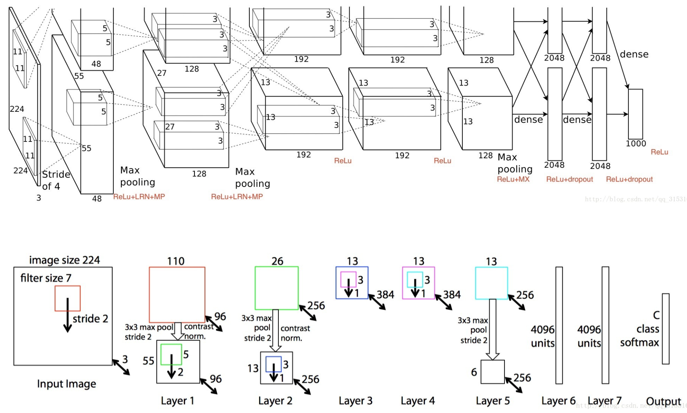
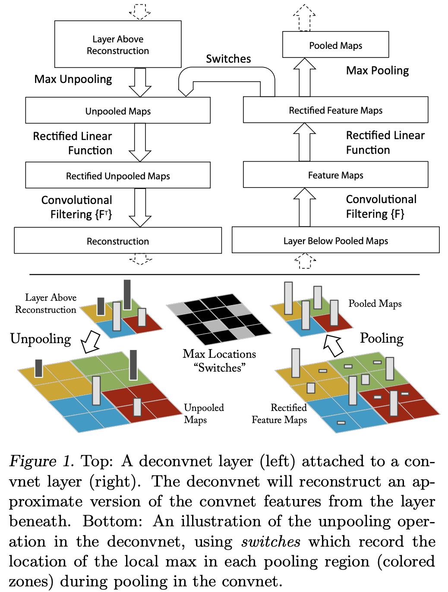
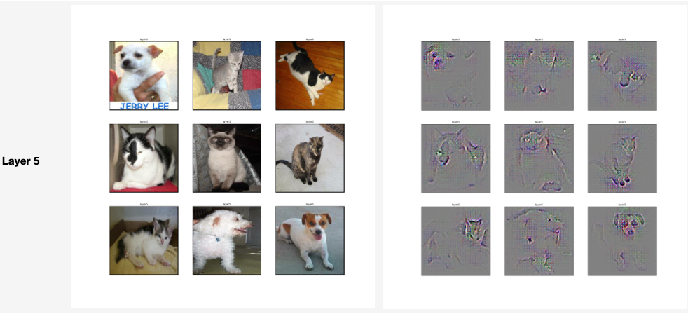
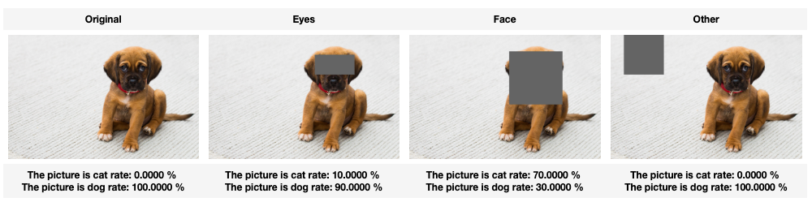
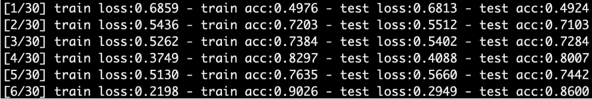
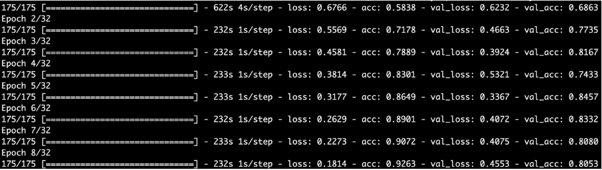
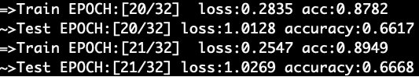

<figure class="third">
    
</figure>

# ZFNet

You need to view the original paper of [ZFNet](https://arxiv.org/pdf/1311.2901.pdf)

In ZFNet, have two parts of contents,you can view AlexNet(Theory)  to understanding AlexNet.

**[1.Visualization](2_Visualization)**

- Unpool And Normal
> 
- AlexNet Visualization

> 

> 

**[2.ZFNet](3_ZFNet_Model)**

> **Tensorflow**
>
> 

>**Keras**
>
>

> **Pytorch**
>
> 

