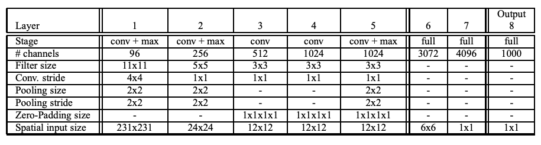
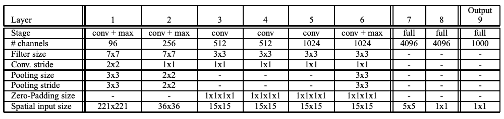
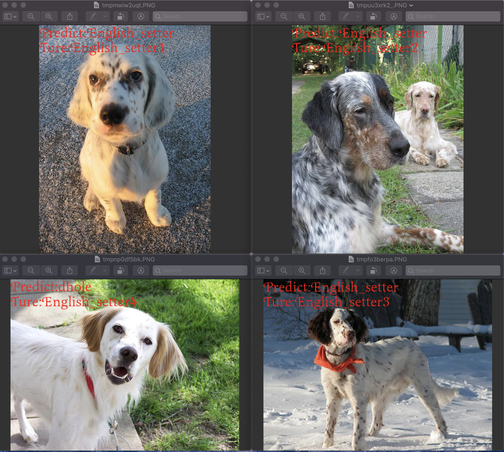
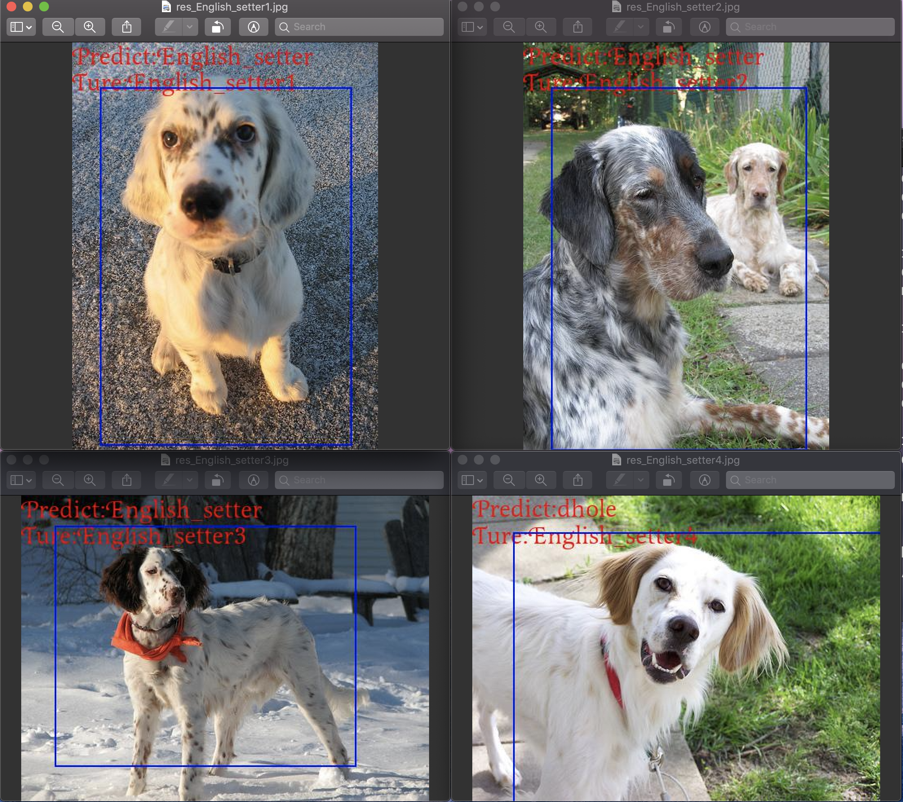
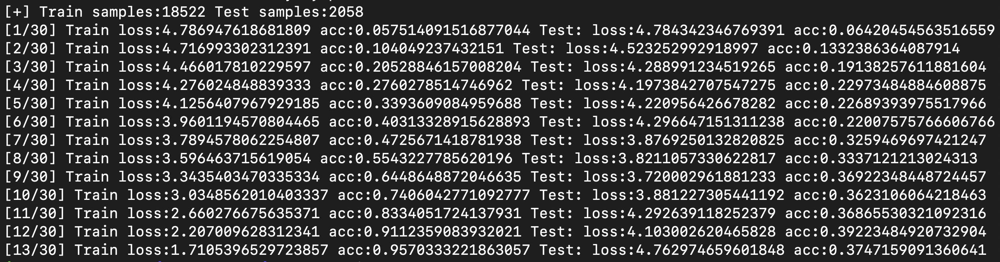
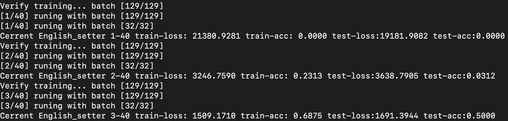

<figure class="third">
    
</figure>

# OverFeat

You need to view the original paper of [OverFeatNet](https://arxiv.org/abs/1312.6229)

**Architecture specifics for fast model**

**Architecture specifics for accurate model**

**[1.Classification](Tensorflow/Classification_/Classification.py)**

> Multi-Scale
>
> 

[2.Regression](Tensorflow/Regression_/Multi_scale.py)

> 

The OverFeat taining result(about three hours):

> **Classification **
>
> 
>
> **Rregression**
>
> 

