<figure class="third">
    
</figure>

# VGG-16

You need to view the original paper of [Very Deep Convolutional NetWorks for Large-Scale Image Recognition](https://arxiv.org/pdf/1409.1556.pdf)

VGG-16 Model

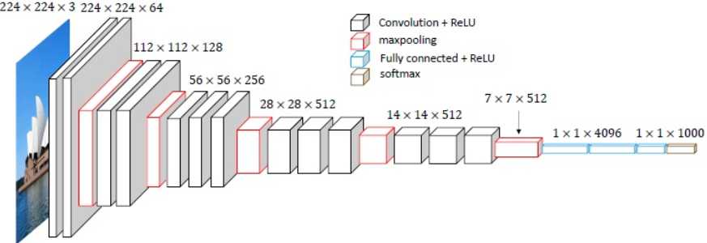

**1. [Classification](TensorFlow_Pre_Train/CVGG16.py)**

>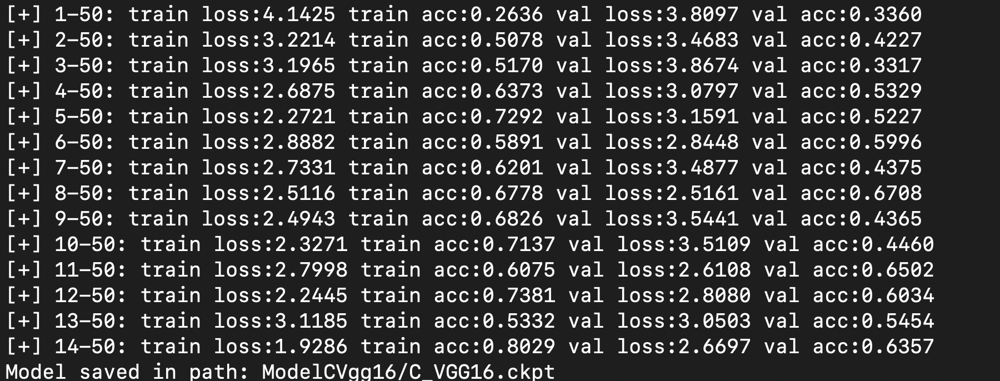

**2. [ClassificationTesting](TensorFlow_Pre_Train/CTesting.py)**

> <table border="0">
> 	<tbody>
>     <tr>
> 			<td style="text-align: center"><strong>toy_terrier</strong></td>
> 			<td style="text-align: center"><strong>African_hunting_dog</strong></td>
>             <td style="text-align: center"><strong>Pembroke</strong></td>
>             <td style="text-align: center"><strong>Pug</strong></td>
> 	</tr>
>     <tr>
> 			<td > 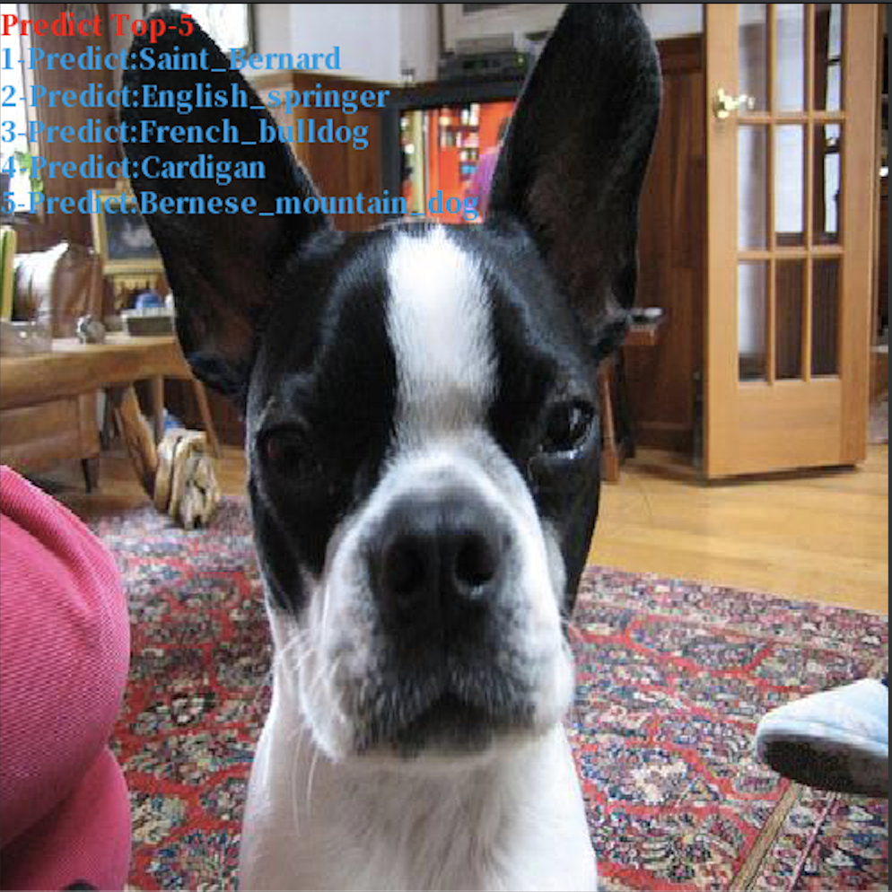</td>
> 			<td > 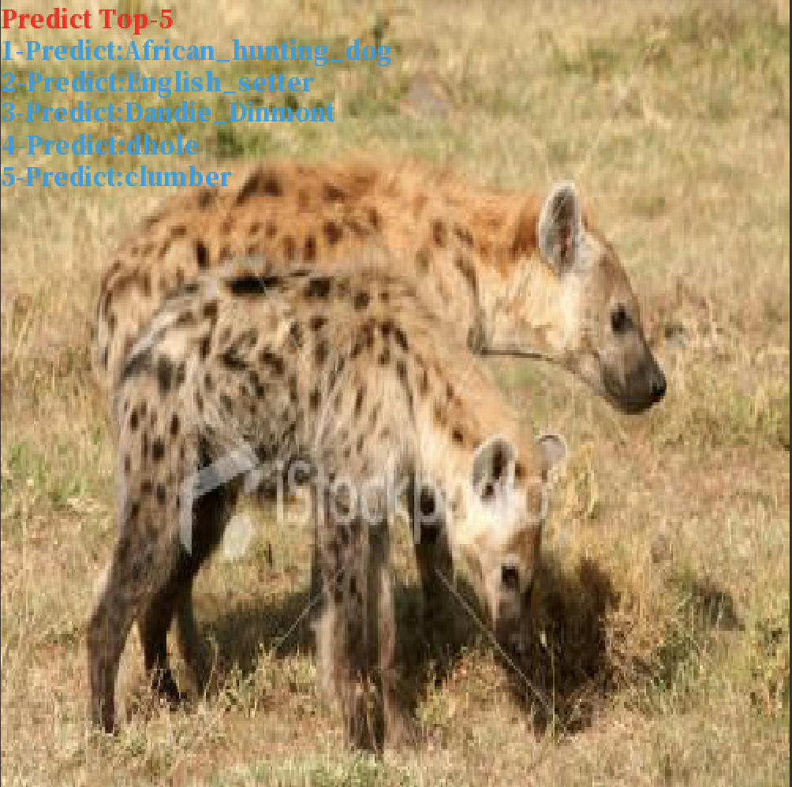</td>
>             <td > 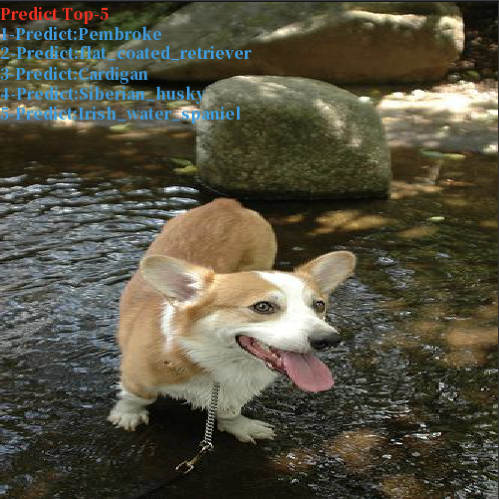</td>
>             <td > 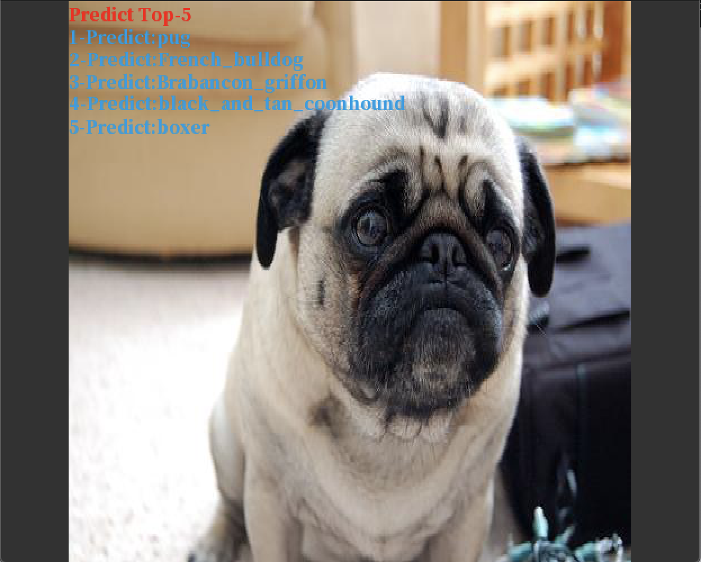</td>
> 	</tr>
> 	</tbody>
> </table>

**3. [Regression](TensorFlow_Pre_Train/RVGG16.py)**

> 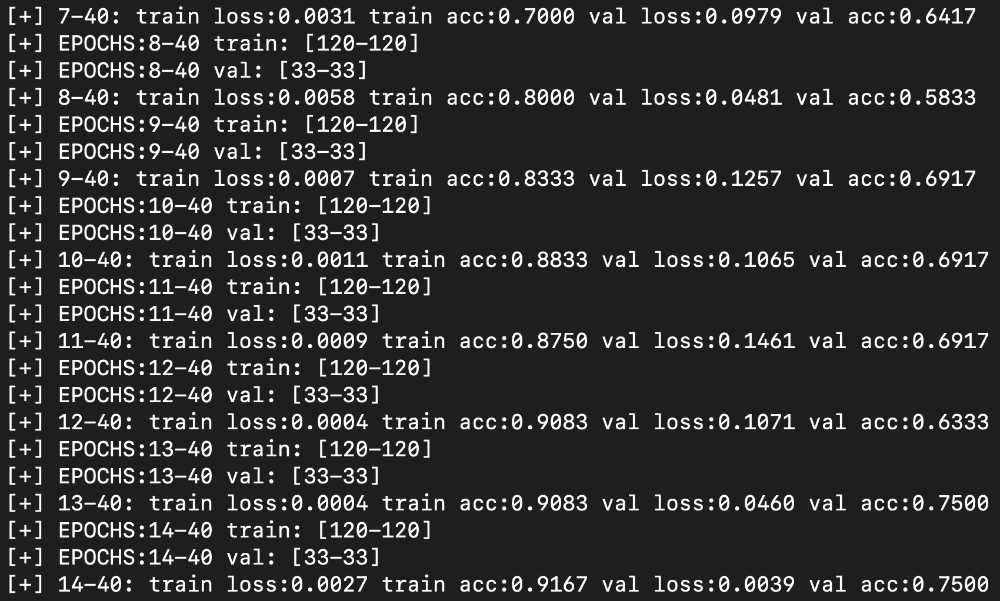

**[4. RegressionTesting](TensorFlow_Pre_Train/RTesing.py)**

> <table border="0">
> 	<tbody>
>     <tr>
> 			<td style="text-align: center"><strong>Good</strong></td>
> 			<td style="text-align: center"><strong>Common</strong></td>
>             <td style="text-align: center"><strong>Poor</strong></td>
>             <td style="text-align: center"><strong>Poor</strong></td>
> 	</tr>
>     <tr>
> 			<td > 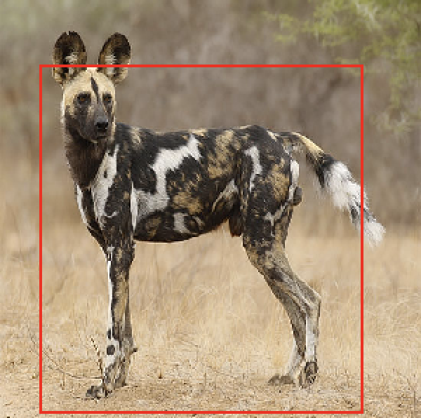</td>
> 			<td > 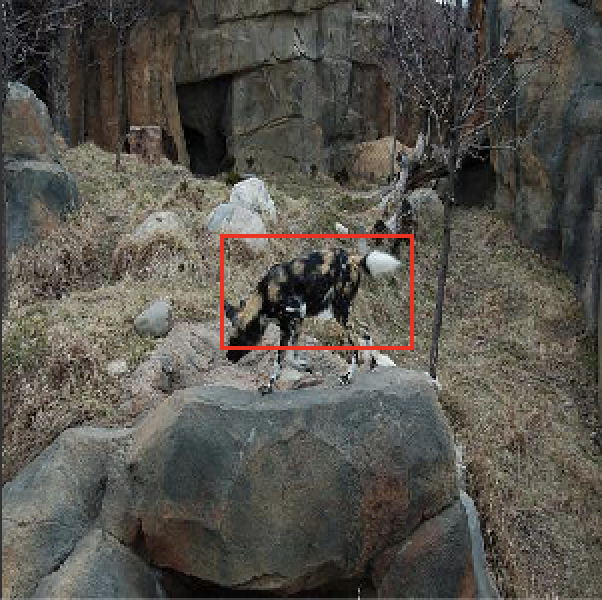</td>
>             <td > 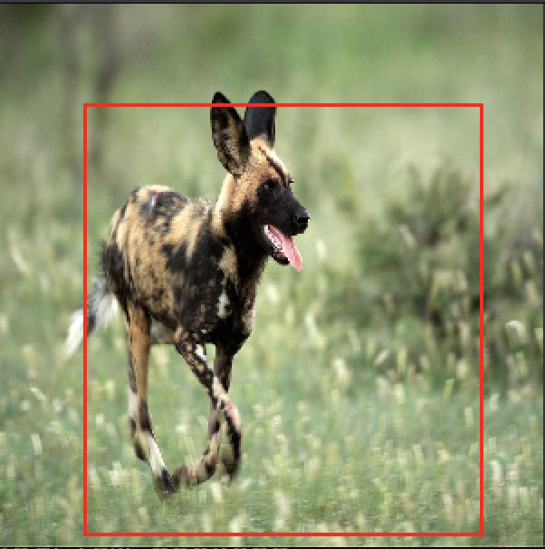</td>
>             <td > 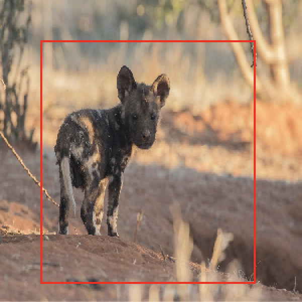</td>
> 	</tr>
> 	</tbody>
> </table>

