<figure class="third">
    
</figure>

# YOLO V1

[You Only Look Once: Unified, Real-Time Object Detection](https://arxiv.org/pdf/1506.02640.pdf)

注意事项:

(1) 我不会根据论文的思路讲解YOLOV1,因为论文写的太简单了,以至于在实施YOLO的时候会出现许多问题,我这里只讲解我在实施的时候遇到的一些问题.

(2) 如没有特殊提醒,下面论述的YOLO指的是YOLOv1.

(3) 由于GIthub不支持在线解析LaTeX,所以你可能需要按照以下方法[安装Chrome插件](https://blog.csdn.net/u014568072/article/details/88872404)或者Download到本地.

(4) 如果你无法正常加载Latex可以查看[YOLOv1-PDF](photos/README.pdf)

## 1. 前言

在讲解YOLO之前,我们先来回顾一下Computer Vision中几大任务:

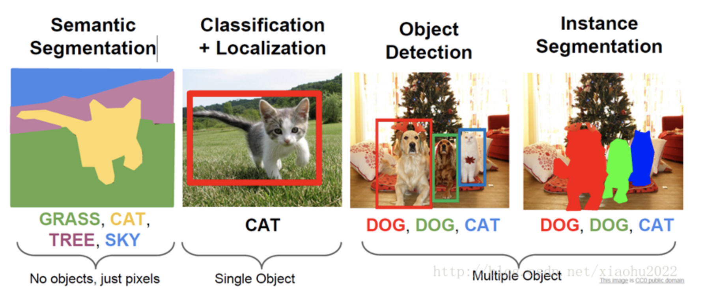

以上就是计算机视觉中常见的几大任务,实际上之前我们已经做过Classification+Localization,我们以OverFeat为例,其会创建两个部分Classification和Regression,在检测的时候,图片先经过Classification预测出类别接着进入Regression网络去预测具体的位置,如果是多目标,那么我们可以使用窗口滑动的方法:每次获取原图的一小块送入Classification和Regression网络,这样就能检测出这个小块中的物体和位置,接着滑动这个小块,重复以上操作,最终就可以获得整张图片所有的目标分类和位置.实际上在YOLO之前都是这样做的,但是这样做冲版单没什么问题,不过要是想应用于工业级的话就会有问题,其中最大的问题就是速度太慢,那么YOLO就是来解决这个问题的.

YOLO不再像之前一样将其分解为分类和回归两个部分而是只看做单一回归问题直接从图像像素得到边界框坐标和类别概率.据作者说YOLO的基础版本以每秒45帧的速度运行,而快速版本运行速度超过150FPS,也就意味着在不到25毫秒的延迟内实时处理流媒体视频.实现结果作者给出了链接地址:http://pjreddie.com/yolo/.

那么YOLO为什么会如此之快呢?作者在论文开始部分就给出了YOLO整个的处理流程:

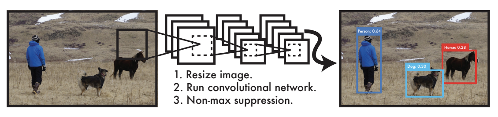

**Figure1.**

可以看到,输入一张图片,经过一个卷积网络直接就可以获取到结果,不用再像之前一样经过两步,这就是YOLO能够实时处理的基础.

知道了YOLO的目标和速度,我们来看看YOLO是如何实现的.

## 2. YOLO Net

让我们先来看看YOLO的网络是如何搭建的:

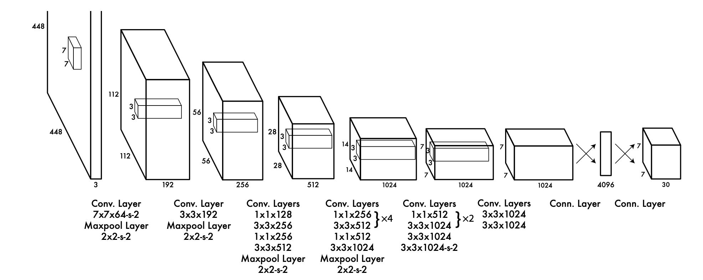

**Figure3.**

上图就是YOLO的**检测网络结构**,输入一张$448\times 448\times 3$的图片,经过24个卷积层和两个全连接层后再将输出**reshape**为$7\times 7\times 30$.

那么接下来我们来看看YOLO是如何训练的,实际上作者将该网络的前20个卷积层使用ImageNet进行训练,需要注意的是,在使用ImageNet训练的时候,网络的输入是$224\times 224\times 3$大小.在获得了这20个卷积层的最优参数后为了保证细粒度的视觉信息,作者将$224\times 224\times 3$的输入更改为$448\times 448\times 3$,然后借鉴前人的思想:"预训练网络中增加卷积层和连接层可以提高性能"所以作者就再加了4个卷积层和2个全连接层.另外作者在论文中说明除了最后一层,其他层全部采用以下激活函数:

$\phi(x)=\left\{\begin{matrix}
x & if \;x >0\\ 
0.1x & otherwise. 
\end{matrix}\right .;$

为了避免模型过拟合,作者在第一个全连接层使用$rate=0.5$的$dropout$.还有使用高达$20\%$的数据增广,其他的训练信息在这里就不多阐述了,因为现在已经有了更加优秀的Optimizer和其他的参数设置.如果你想源生按照论文去训练你可以自己看论文,已经写的很详细了.

### 2.1 what's $7\times 7\times 30$ ?

现在我们来看看论文中第一个难点,就是网络的这个输出.我们分两步来讲解:

**Part1. $7\times 7$**

我们先来看看这个$7\times 7$到底是什么东西.实际上在网上的资料有很多,但是大多都没说清楚这个$7\times 7$是什么东西.这个$7\times 7$实际上是一个**映射**,我揣测作者的意图应该是这样的,作者将网络最后的输出看层是输入图片的映射,体现为作者将输入图像划分为$7\times 7$的网格(grid cell):

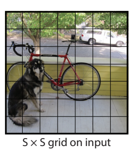

以上图为例,输入一张$448\times 448$大小的图片将图片看做划分为$7\times 7$的大小,当图片经过检测网络之后,得到一个$7\times 7$的结果,这个结果实际上是一个一一对应的值:

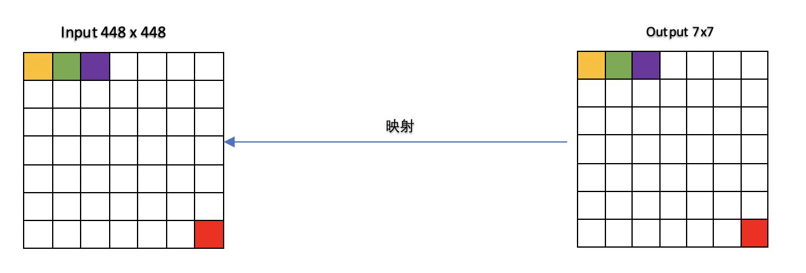

也就是说$output:7\times 7$中的第一个值(黄色)相当于第一个网格经过检测网络后预测出来的值,第二个值(绿色)相当于第二个网格经过检测网络后预测出来的值,有点像感受野的感觉,也像多个滑动窗口同时进入检测网络后同时预测出多个窗口的值.

**小结一下**:网络中输出的$7\times 7$与原图输入$448\times 448$是一个映射关系,$7\times 7$中每一个值都是原图$448\times 448$的映射结果.

在搞清楚这个$7\times 7$之后我们就可以来看看这个$30$是什么.

**Part2. $30$**

我们上面说到$7\times 7$中每一个值都是原图$448\times 448$的映射结果,这个**值**并不是单一的一个数值而是一个向量,这个向量有30个数值,我们来一一讲解.

(1) 20个类别:

首先作者将检测网络放在VOC2012数据集上训练,该数据集含有20个类别,30个数值中的20个是类别的预测值.关于数据集[VOC2012下载](https://pjreddie.com/projects/pascal-voc-dataset-mirror/)

作者定义每一个网格都会预测这20个类.

(2) 两个边框bboxes:

我们知道作者将原图划分为$7\times 7=49$个网格,**每一个网格会预测两个边框**,所以边框总数为$49\times 2=98$个,这些边框都会预测一下内容:

- 边框置信度$C_{bboex}$:其**定义**为$P_{r}(Object)*IOU^{true}_{predict}$,如果该网格含有目标则$P_{r}(Object)=1$否则$P_{r}(Object)=0$,$IOU^{true}_{predict}$就是我们之前的交并比.需要注意的是**这个值并不是完全体,我这里使用的是定义两个字,意味着作者这样去定义方便后面的推理**,关于这个$C_{bboex}$还有一些注意的地方我们后面会讲解,这个部分我们先略过.
- 目标中心坐标值$x,y$:每一个边框都会预测物体的中心坐标,需要注意的是这个坐标是每一个网格的相对值所以它们是一个介于$[0,1)$之间的一个值.
- 目标宽高坐标值$w,h$:每一个边框都会预测物体的宽和高,这个宽高是基于448的一个百分比,也是介于$[0,1)$之间的一个值.

我知道,大家看到这里还是不明白这些值的意义,我们来看看下面这张图(以自行车为例子):

假设我们的目标是自行车.$x,y$就是这个网格的相对位置,比如$x=0.6,y=0.4$,$w,h$是一个相对于图片输入大小$448\times 448$的百分比值,我们可以使用以下方法计算这4个值:

一般数据集会给予目标(Object)的$x_{min},y_{min},x_{max},y_{max},width, height$,有这几个参数之后,我们可以计算出目标中心坐标

$x_{center}=(x_{min}+x_{max})/2$

$y_{center}=(y_{min}+y_{max})/2$

因为值$x,y$是$x$相对于网格的偏移量,所以:

(1) $x,y$:

- $x:x=(x_{center}-64*2)/64$
- 因为图片大小是$448$,所以每一个网格的大小是$64$,这样我们就可以获得一个介于$[0,1)$之间的值,在后面我们会知道作者这样做是方便计算Loss和IOU.$y$也是类似于这样计算.

(2) $w,h$

- 宽和高的**百分比值**就更好计算了.
- $w:w=width / 448$
- $h:h=height/448$

需要注意一点,在后面我们还会用到这种图,我们上面所说的**目标**还有需要强调的地方.

到目前为止,我们就搞清楚了$c_{bboxes},x,y,w,h$,那么一个网格含有两个边框(bboxes)再加上每一个网格预测的20个类,那么大小就应该是$[2 * 5 + 20]=30$.这样我们就明白了网络中$30$到底表示什么意思.

**小结一下**:

我们将网格的数量定义为$S$,每一个网格预测边框的个数定义为$B$,将类别数定义为$C$,那么我们最终就会产生$[S\times S\times (B*5 + C)]$.其中$S$表示输出的单元和原图输入划分格为映射关系,$B$表示每一个网格的预测值个数,预测值包括了基本项$c_{bboxes},x,y,w,h$.

如果你能够大致明白$7\times 7\times 30$,那么就能够明白下图:

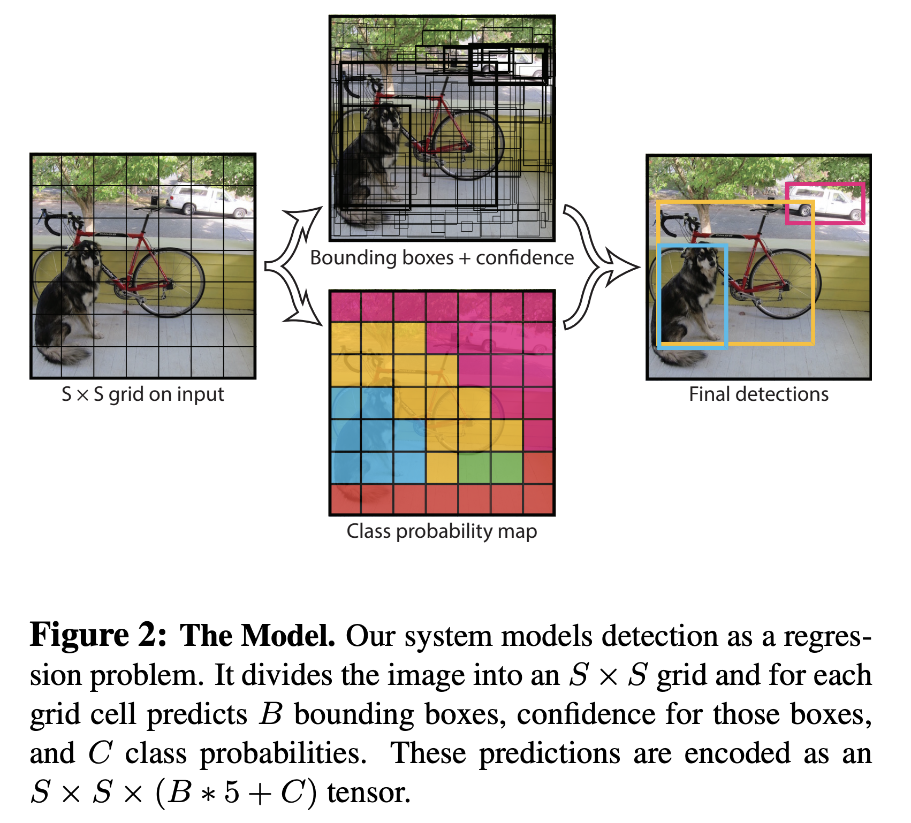

将输入的图片看做是划分$7\times 7$的网格,经过检测网络后每一个网格都会给出$B*5$个值,在处理这些值就得到了最后的预测结果.

## 3. Loss

在说明白了检测网络输出的维度的意义之后,我们来看看论文中第二个比较难的地方同时也是创新比较大的地方.我们先来看看作者是如何定义Loss的:

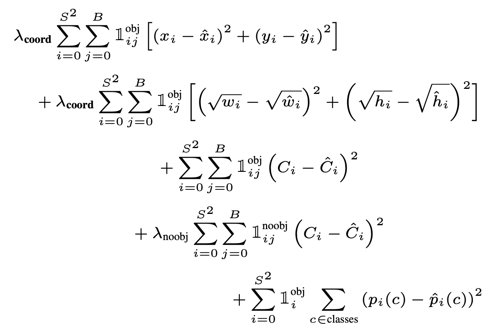

Loss看起来非常恐怖,我们慢慢的来捋一下是怎么回事.

### 3.1 what's $1_{i}^{obj}$

在论文中作者说这个指示标记的意思是包含“检测目标”,那么这个包含到底是什么意思呢?我们来看下图

对于目标自行车而言,左一网格左二网格看上去都包含自行车这个目标,那么这个$1_{i}^{obj}$指的是这个意思吗?如果是那么情况未必也太多了吧,也就是说红色边框内的所有网格都要参与Loss的计算.实际上作者指的"包含目标"不是这个意思,而是指的目标的中心是否在这个网格内,也就是说对于自行车而言,只有图中红色圆点的那个网格才参与Loss的$1^{obj}_{i}$,我们可以深入的理解一下:如果作者指的是第一种情况,也就是只要有目标部分的网格就参与Loss计算,那么狗和自行车重合的部分这些网格到底是学习狗这个类还是自行车这个类呢?所以作者指的"包含目标"是指**目标中心落在网格内**的那些网格:

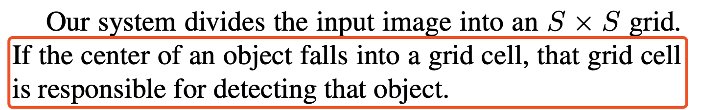

这段是论文开篇的时候作者就提出来的,意思是如果目标的**中心**落在这个网格内,那么这个网格就负责($responsible$)这个目标的检测.

说清楚了这个$1^{obj}_{i}$意思,我们来看看$1^{obj}_{ij}$.

### 3.2 what's $1_{ij}^{obj}$

我们知道每一个网格会预测$B$个网格,这里我们以$B=2$来举例,首先我们要清楚一点,作为数据集的标签,它只有一对$c_{bboxex},w,y,w,h$,那么在计算Loss的时候,虽然我们预测出来2个边框,但是只能是一个与标签计算Loss,那么如何挑选出这个比较好的边框呢?作者给出的建议是选择与真实边框$IOU$最大的那么值计算Loss:

上面的意思是,对于含有目标的网格,选择其预测边框与真实值最大$IOU$来负责"responsible"计算损失.

一句话概括一下:对于含有目标的网格,网络会给出$B$个预测边框,我们挑选出与真实边框$IOU$最大的那个$j$来计算损失.

### 3.3 what's $\lambda_{coord},\lambda_{noobj}$?

上面我们都是讲解如果该网格包含目标的情况,那么不包含目标的网格就不需要学习了吗?实际上不是的,我们应该让不包含目标的网格"知道自己的区域是没有目标的".所以我们也需要加上不含目标的网格,但是会出现一个问题,那么就是权重的问题,我们来试想一下,如果一张图片中只有一个目标,那么实际上要参与$obj$计算的只有一个预测边框,那么剩余的绝大多数都不需要计算$obj$项,也就是说没有目标的项权重会更大,从而会导致Loss偏向于更新计算不含目标的网格.这样肯定是不被允许的,所以作者做了一个投机取巧的办法,就是设置权重项$\lambda_{coord}=5.0,\lambda_{noobj}=0.5$,这样我们既可以让网络学习不包含目标的网格,同时也不至于因为权重过大而导致Loss偏向的问题.

### 3.4 calulate loss

在说明完Loss几个比较重要的地方之后,我们看看Loss是如何计算的.

我们定义数据标签为:$[c_{bboex},x,y,w,h,classes]$的形式,其中对于$classes$,如果目标出现则相应的索引位置为1.只有含有目标的网格$c_{bboex}=1$并且$x,y,w,h$有值,否则$c_{bboex}=0$且$x,y,w,h=0$

(1) 中心坐标误差$x,y$:

$\lambda_{corrd}\sum_{i=0}^{S^2}\sum_{ij}^{B}1^{obj}_{ij}[(x_i-\hat{x_i})^2 + (y_i-\hat{y_i})^2]$

从形式可以看出其实平方和误差(SSE),我们只需要获取"$responsible\ j$"的$x,y$与标签进行计算即可.

(2) 宽高误差$w,h$:

$\lambda_{corrd}\sum_{i=0}^{S^2}\sum_{ij}^{B}1^{obj}_{ij}[(\sqrt{w_i}-\sqrt{\hat{w_i}})^2 + (\sqrt{h_i}-\sqrt{\hat{h_i}})^2]$

这里为什么要做开根号处理呢?作者说"大框的小偏差的重要性不如小框的小偏差的重要性",也就是说如果小边框如果有偏差了,那么对其最终的预测影响会大于大框的小偏差.所以惩罚需要更大.

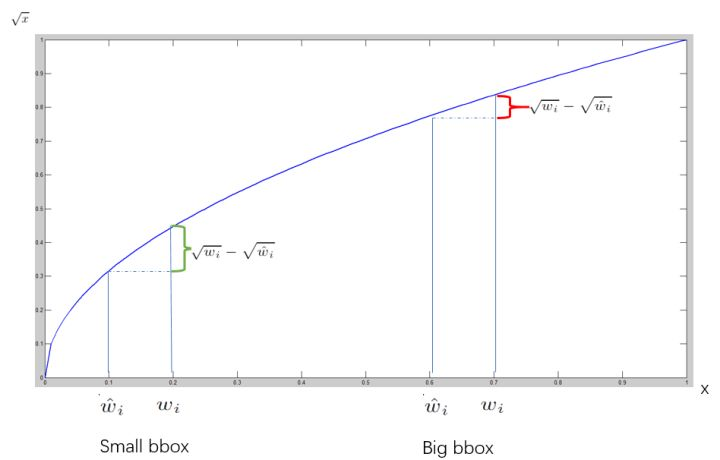

可以看到开根号后,$Small\ bbox$的惩罚会大于$Big bbox$.从而也就体现了"大框的小偏差的重要性不如小框的小偏差的重要性".

另外对于计算宽高的时候需要注意,在模型训练的前期肯定会产生负数,那么我们只要采取极小项就可以让模型扛过前期的训练,不会应为值为负数而无法计算根号.

(3) 边框置信度$C_{bbox}$

$\lambda_{noobj}\sum_{i=0}^{S^2}\sum_{ij}^{B}1^{obj}_{ij}(C_i-\hat{C_i})^2$

对于边框置信度,会有些难以理解的地方,因为这个值是Loss中唯一在$noobj$时参与Loss计算的,第一点需要注意的是这个$C_{box}$是不需要预计算的,也就是说不需要使用$P_{r}(Object)*IOU^{true}_{predict}$计算的,我们可以来做一下假设,如果需要使用这个预计算,那么对不不含有目标的网格其$P_{r}(Object)=0$,那么Loss中的$\lambda_{noobj}$就为0,从而计算Loss没有任何意义.那么到底如何来理解这个边框置信度呢?

(3.1)我们可以想象,如果网格不包含目标,那么我们是需要让这个网格知道"自己的范围内是没有任何目标的",我们的标签设置为不含目标的网格$\hat{C_{bbox}}=0$,那么经过Loss的计算学习,最终$C_{bbox}$会趋向于0.

(3.2)关于$P_{r}(Object)*IOU^{true}_{predict}$是在评价模型的时候为了方便推导出真正的类别置信度,作者才会这样定义,后面会细说.

(4) 类别$Classes$:

$\sum_{i=0}^{S^2} \sum_{c\in clases}(p_i(c)-\hat{p_{i}(c)})^2$

那么类别的Loss就没什么好说的了,直接计算含有目标的网格即可,让这些网格知道自己的网格内含有什么类别,细心的朋友可能会发现,如果这个网格内含有多个目标而作者将网格的类别定义为"一个网格只预测一个类别".那么不就会有问题?没错,这也是YOLOV1中最大的问题,可能作者是基于这样的考虑"一个网格内同时含有两个物体的概率非常低,特别是将网格继续分成更多个的时候.",不过也没关系.我们在YOLOV2,V3的时候会解决这个问题.

现在我们已经搞明白了Loss,接下去我们来看看Testing.

## 4. Tesing

纵观整篇讲解,我们还有最后一个问题没有解决:$P_{r}(Object)*IOU^{true}_{predict}$,这个东西到底该怎么使用呢?

这里假设测试阶段的时候我们只有1张图片,这样设计为了方便讲解.

当模型训练好了之后,我们将测试集喂如模型,计算正确率mAP(关于mAp在代码中会讲解)和训练的时候一样,网络会输出$7\times 7\times 30$大小的向量,排列方式我们定义为$[c1,x1,y1,w1,h1,c2,x2,y2,w2,h2,classes]$.

实际上定义方式可以任意的,我是习惯于这种定义方式.

网上有些人喜欢定义为$[c1,c2,1,x1,y1,w1,h1,x2,y2,w2,h2,classes]$,这都是可以的只要保证训练的时候与标签一一对应即可.

那么当测试集通过网络了之后我们可以获取到$98(7\times 7\times 2)$个预测bboxes,也就是说我们有98个$C_{bboxes}$,但是这个$C_{bboxes}$真的能体最终的置信度吗?事实上它只能体现边框的置信度而类别的置信度却无法体现(因为类别置信度是和预测的类别相关的量),所以实际上我们的置信度应该包括两项:1.类别,2.边框,这两个置信度,等同于$P_{classes} * IOU^{true}_{predict}$,前者体现为类别概率后者为边框,那么我们按照这个思想往前推到就可以得到论文中的公式:

$P_{r}(Classes|Object)*P_{r}(Object)*IOU^{true}_{predict} = P_{classes} * IOU^{true}_{predict}=C_{classes}$

也就是说我们如果想得到能够同时体现类别和边框我们只需要将预测出来的置信度乘上预测出来的概率即可.正是因为如此,作者将预测出来的$C_{bboex}$定义为:$P_{r}(Object)*IOU^{true}_{predict}$.

我希望我已经说明白了这个预测出来的$C_{bboxes}$是什么意思,如果你还不能明白,你可以简单的考虑为这个$C_{bboex}$定义只是为了方便计算和度量能够涵盖类别和边框的置信度值.

### 4.1 work

在理解了$C_{bboex}$之后,我们来看看测试过程是怎么样的,下面阐述的过程是最自然,最能够直观理解的方式,需要注意的是这里的过程和论文中是不一样的,如果你想了解论文是如何操作的,我会将地址附在该段结束部分.

(1) 在测试图片经过检测网络之后我们得到了$[c1,x1,y1,w1,h1,c2,x2,y2,w2,h2,classes]$,我们将形状改变一下,我们copy出$classes$的部分,将形状更改为$[c1,x1,y1,w1,h1,classes]$和$[c2,x2,y2,w2,h2,classes]$,这么做的好处是能够将所有的bboxes全部独立出来,每一个bbox都含有所需要的所有信息.方便后面计算筛选.

此时形状为$[7\times 7\times 2\times 25]$

(2) 对于每一个bbox,我们使用$c_{boxes}$去乘上$classes$即可得到类别置信度.需要注意的是此时的$c_{bboxes}$已经没有什么作用了.

此时形状为$[7\times 7\times 2\times 25]$,如果你抛弃掉$c_{bboxes}$,那么形状为$[7\times 7\times 2\times 24]$

(3) 接着我们将类别置信度$C_{classes}$,最大的那个作为预测概率值,此时的形状为$[7\times 7\times 2\times 5]$,

(4) 我们将设置一个类别置信度阈值(比如为0.4),过滤掉所有小于该置信度的bboxes.剩下来的就是置信度较高的bboxes了.

**非极大抑制(non maximum suppression,NMS)**

在继续讲解之前,我们先来看看什么是非极大抑制,这个算法不单单是针对Yolo算法的,而是所有的检测算法中都会用到,NMS算法主要解决的是一个目标被多次检测的问题.比如下图:

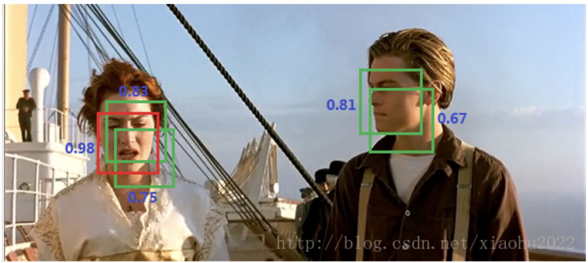

我们现在能够得到了置信度较高的bboexs了,就如图上所示,数值即代表置信度,现在我们要在这么多边框的情况下找找最好的那一个,比如rose的红色部分,那么使用NMS来处理:首先从所有的检测框中找到置信度最大的那个框,然后挨个计算其与剩余框的IOU,如果其值大于一定阈值(重合度过高),那么就将该框剔除;然后对剩余的检测框重复上述过程,直到处理完所有的检测框.

(5) 接下去我们将所有具有较高类别置信度的bboxes使用NMS,那么经过筛选出来的就是最终的bboexes了.

以上就是在Testing时最直观处理方法,这里需要注意的一点是,在使用NMS的时候我们将所有类别的bboxes都一视同仁,实际上根据理论而言我们应该分类别进行NMS,但是网上大多实现都是将其一视同仁.可能是同一个地方同时出现多种类别的概率比较小吧.

最后如果你想按照论文的方法去实现Testing,那么可以观看一下地址:[Youtube](https://www.youtube.com/watch?v=L0tzmv--CGY&t=434s),这里就不再过多讲解了.

**Result**

最后附上按照这篇理论搭建完模型之后的预测结果:

<table border="0">
	<tbody>
 <tr>
			<td style="text-align: center"><strong>Test1</strong></td>
			<td style="text-align: center"><strong>Test2</strong></td>
	</tr>
 <tr>
			<td > 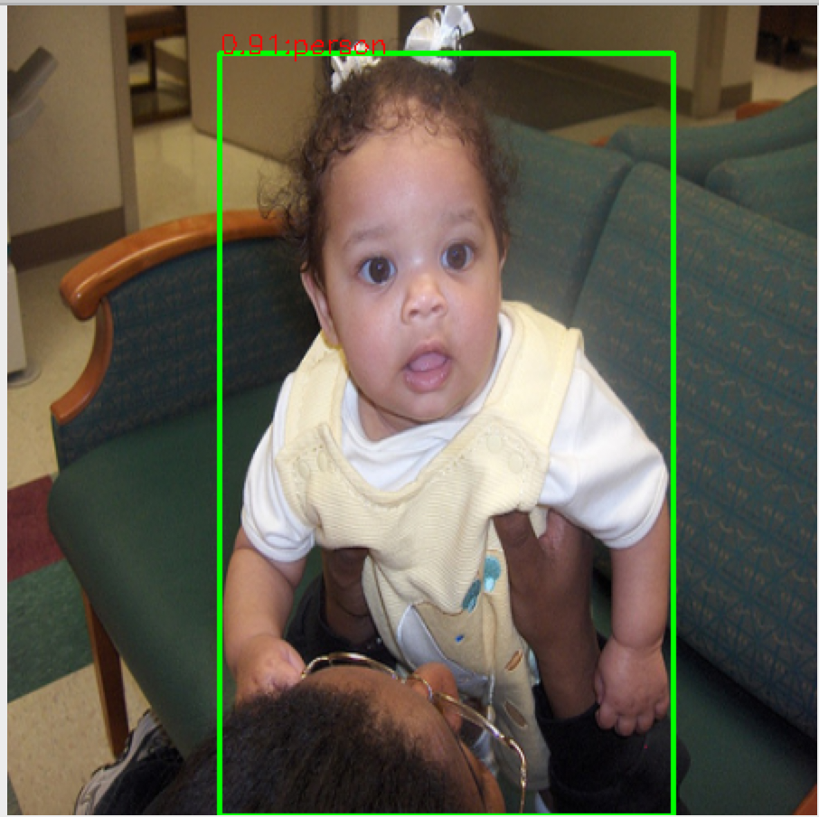</td>
			<td > 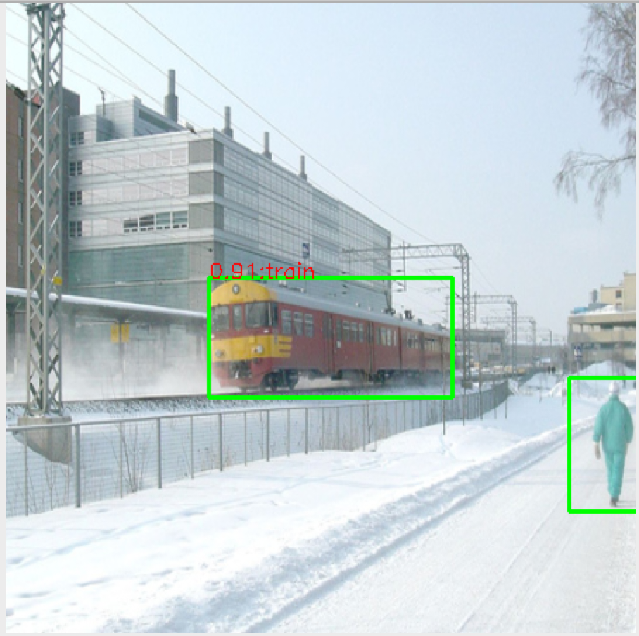</td>
	</tr>
	</tbody>
</table>

到这里为止YOLOv1重要的地方就讲解完毕了,论文其他地方就在在说YOLO厉害的地方以及和其他模型评比的过程,这里就不再阐述了.

**Reference**

[1] [You Only Look Once: Unified, Real-Time Object Detection](https://arxiv.org/pdf/1506.02640.pdf)

[2] [YOLO v1 论文翻译](https://zhuanlan.zhihu.com/p/35416826)

[3] [YOLO算法的原理与实现](https://blog.csdn.net/xiaohu2022/article/details/79211732/)

