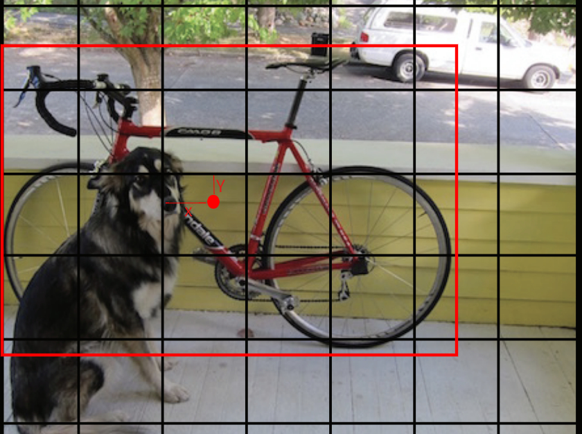
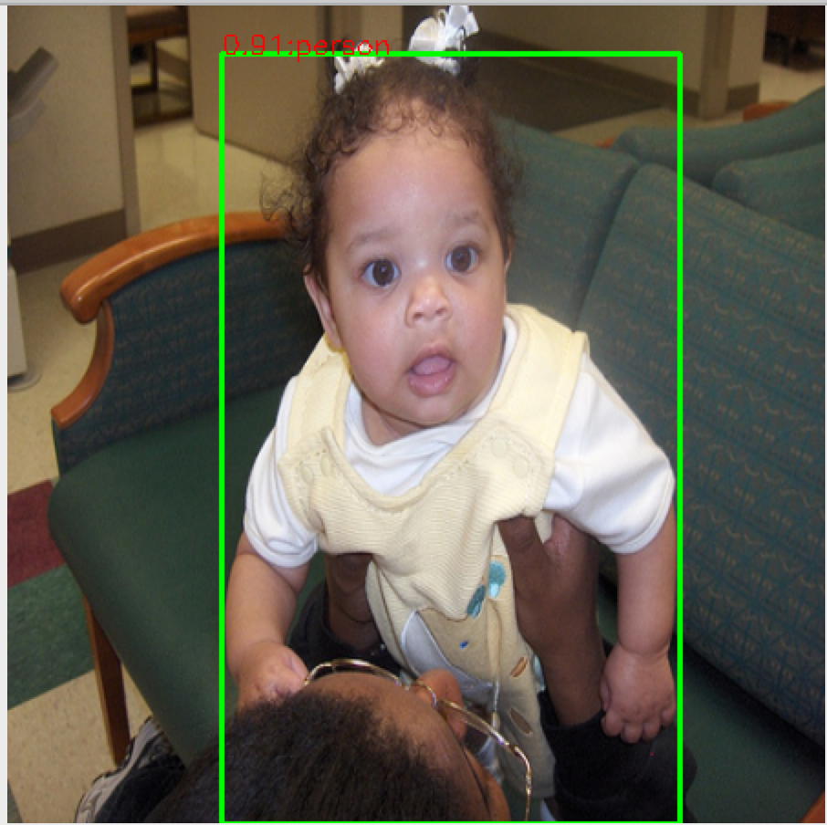

<figure class="third">
    
</figure>

# YOLOV1 Code

现在我们来看看如何使用TensorFlow来实现YOLOv1.


### 1.YOLO Net

首先我们先来看看YOLO的架构:


输入一张$448\times 448\times 3$的图片,经过24个卷积层和两个全连接层后再将输出**reshape**为$7\times 7\times 30$.前20个卷积层使用ImageNet进行训练,需要注意的是,在使用ImageNet训练的时候,网络的输入是$224\times 224\times 3$大小.在获得了这20个卷积层的最优参数后为了保证细粒度的视觉信息,作者将$224\times 224\times 3$的输入更改为$448\times 448\times 3$,然后借鉴前人的思想:"预训练网络中增加卷积层和连接层可以提高性能"所以作者就再加了4个卷积层和2个全连接层.另外作者在论文中说明除了最后一层,其他层全部采用以下激活函数:

$\phi(x)=\left\{\begin{matrix}
x & if \;x >0\\ 
0.1x & otherwise. 
\end{matrix}\right .;$

为了避免模型过拟合,作者在第一个全连接层使用$rate=0.5$的$dropout$.

**Ps:**

(1) 如果想要复现YOLO的预训练过程,那么代价将是巨大的,所以我们使用已经预训练好的VGG16作为预训练模型,论文中也阐述了使用VGG16作为YOLO的预训练正确率会更高,但是速度会更慢,由于硬件的限制,所以我只能退而求其次的选择的选择VGG16作为预训练模型,因为使用的是VGG16所以最终的预训练输出结果应该是$[bs,14, 14, 512]$的大小,后面部分和YOLO一致.

(2) 你也可以选择下载[YOLO预训练模型的权重文件](https://pjreddie.com/media/files/darknet53.conv.74),但是使用的是darknet框架,所以你可能还需要将其转换为TF能够接受的格式.

(3) 由于代码比较多,所以我只讲解比较重要的部分.

(4) 本代码使用TensorFlow==1.13.2

(5) 由于硬件原因,我只训练了5张图片(放在TestImgs文件夹),但是搭建的代码能够识别和模型过拟合,这就说明模型没有问题,如果你的硬件可以,那么只需要微调超级参数即可.

### 2.GetDataset

首先第一步就是处理数据集,对于VOC2012而言,我们需要用到的只有Annotation和JPGImages文件,数据集我就不多说了网上资料很多可以自行查看.

#### 2.1 Handel $(x,y,w,h)$

我们知道YOLO的坐标$x,y,w,h$是介于$[0,1)$之间的数字而对于$w,h$而言比较简单,直接从Annotation下的xml文件里面去读取出来然后除上448即可,但是$x,y$是关于网格的偏移量,所以我们需要着重来讲解一下:

```python
def _get_cell_info(o_width,o_height,resize_wh,location_list,cells_num):
    cell_num = resize_wh // cells_num # 448 // 7 = 64
    xmin,ymin,xmax,ymax = location_list
    # 等比例缩放到目标尺度
    w,h = resize_wh / o_width, resize_wh / o_height
    xmin,ymin,xmax,ymax = xmin * w, ymin * h, xmax * w, ymax * h
    center_x = (xmax + xmin) / 2
    center_y = (ymax + ymin)/ 2
    # 获取第一个cell含有x,y这个点
    x_id = int(center_x // cell_num)
    y_id = int(center_y // cell_num)
    # 得到 x和 y
    x = (center_x - cell_num * x_id) / cell_num
    y = (center_y - cell_num * y_id) / cell_num
    # 得到 w,h
    _w = (xmax - xmin) / resize_wh
    _h = (ymax - ymin) / resize_wh

    bboxes = [x,y,_w,_h]
    return  x_id, y_id, bboxes
```

首先我们需要将xml文件中的$xmin,ymin,xmax,ymax$缩放到448的尺度,接着我们就需要找寻中心点到底落在哪个网格(代码中使用```x_id,y_id```表示).接下来我们来做一个简单的分析.



以上图为例,对于```x_id```实际上是左数右的第三个网格,由于我们根据$xmin,ymin,xmax,ymax$可以获取到$x_{center},y_{center}$,所以我们只要使用$x_{center}$去整除64即可得到红点距离起始位相差多少个网格,整除出来的结果就```x_id```,那么```y_id```也是同理,当求出```x_id,y_id```之后我们就可以按照公式去求中心点相对于网格的偏移量$(x,y)$:

$x:x=(x_{center}-64*x_{id})/64$

$y:y=(x_{center}-64*y_{id})/64$

这样我们就可以完成$x,y,w,h$了,详细代码请查看[get_cell_info](Utels.py)

#### 2.2 Handel Label

在YOLO中我们知道如果该网格包含目标,那么$C_{bboxes}=1$,所以我们只要按照```x_id,y_id```将label对应的位置设置为1即可,在我的代码中我将label的形状定义为$[c,x,y,w,h,classes]$,实际上它是任意的在之前的文件中我也提到过,只是我喜欢这样设计.

```python
...
x_id, y_id, bboxes = _get_cell_info(width,height,self.resize_wh,location_list,self.cells_num)
if label[x_id,y_id,0] == 1:
  	continue
else:
    # [c, x, y, w, h, classes]
    label[x_id,y_id,0] = 1 
    label[x_id,y_id,1:5] = bboxes
    label[x_id,y_id,5 + cls_id] = 1
...
```

因为一个网格只能是一个类别,所以当多个物体的中心同时落在该网格内,我们也只能取一个,在之前的文件中也说了,这是YOLOV1的最大缺点.

详细代码查看[FilesLoader](GetDataInfo.py)

#### 2.3 Get Datset

根据上面的内容将数据整理了之后进行拆分训练样本和测试样本返回出再使用```tf.dataset```加载文件即可

```python
class DataLoad:
    def __init__(self, sess, batch_size, image_resize):
      ....
```

需要注意的是,我这里并没有做数据增广操作,并且也只是简单的进行归一化,如果想做其他操作可以在```def __paser(self, image, label):...```中自行添加.

详细代码请查看[DataLoad](GetDataInfo.py)

### 3. Create YOLO-VGG16

在整理好数据集之后,我们就可以开始创建网络了,由于我们是使用的VGG16预训练模型,所以我们需要使用

```python
tf.keras.applications.vgg16.VGG16(include_top=False, weights='imagenet')
```

来负责模型前半部分的流程,最后会返回出$[bs,14, 14, 512]$大小的向量.

在训练的时候我使用的是```AdamOptimizer```,总共训练100次,前50次的学习率为$10e-5$,后50次的学习率为$10e-6$,我们不能设置论文的学习率,模型很不稳定,学习率稍大就会导致Loss趋向于$nan$.

详情请查看[**yolo_go**](YoLoVgg16.py)

#### 3.1 Net

让我们先来看看模型处理流程

```python
self.datas = tf.placeholder(tf.float32, (None, 14, 14, 512))
self.targets = tf.placeholder(tf.float32, (None, 7, 7, 25))
self.learning_rate = tf.placeholder(tf.float32)
self.out = self._net(self.datas)
self.response_pre,self.new_labels = _get_response_obj(self.out, self.targets)
self.Sort_TP_FP,self.Sture_label = _Pre_MAP(self.response_pre,self.new_labels,iou_thresh=0.3)
self.cost = _losses(self.response_pre, self.new_labels)
self.Optimizer = tf.train.AdamOptimizer(learning_rate=self.learning_rate).minimize(self.cost, var_list=self.var_list)
```

#### 3.1.1 _get_response_obj

当网络输出后即可得到```self.out```,第一步我们就需要找到那个$responsible$的$j$,首先将网络的输出```self.out```与真实标签```self.target```放入函数```_get_response_obj```，该函数的处理流程为:

(1) 先计算一次IOU,需要注意的是,在计算IOU的时候,我们直接使用$[x,y,w,h]$计算即可,不需要将这些量还原到原来的大小,因为IOU实际上求的是距离,所以在哪里尺度下计算都是一样的:

```python
# 我们用Numpy的版本演示一下即可..
ture = [0.556,0.17333333333333378,0.7344262295081967,0.7099453551912569]
out = [0.556,0.17333333333333378,0.7344262295081967,0.7099453551912569]
def iou(ture, out):
    x,y,w,h = ture
    px,py,pw,ph = out
    xmin,ymin,xmax,ymax = x - w * 0.5, y - h * 0.5, x + w * 0.5, y + h * 0.5
    p_xmin,p_ymin,p_xmax,p_ymax = px - pw * 0.5, py - ph * 0.5, px + pw * 0.5, py + ph * 0.5
    
    in_w = np.minimum(xmax, p_xmax) - np.maximum(xmin, p_xmin)
    in_h = np.minimum(ymax, p_ymax) - np.minimum(ymin, p_ymin)
    logical_and = np.logical_and(np.greater(in_w, 0), np.greater(in_h,0))
    inter = np.multiply(logical_and, (in_w * in_h))
    union = np.multiply(ymax-ymin, xmax - xmin) + np.multiply(p_ymax- p_ymin, p_xmax-p_xmin) - inter
    res = inter / union
    print(res)
iou(ture,out)
>> iou=1.0
```

(2) 在计算出IOU之后,我们要获取出两个边框中IOU比较大的那一个:

```python
# 获取b1和b2最大的iou索引.
indeces_1 = tf.where(iou_obj1 >= iou_obj2)
indeces_2 = tf.where(iou_obj2 > iou_obj1)
```

接着进行切片操作(TensorFlow对于切片操作很不友好!)把相应的索引从网络预测的结果中提取出来即可并且要保证与label一一对应,这样我们就获得了一个只含有$responsible$的$j$,的网格,形状和真实标签一样是$[bs,7,7,25]$.$25:[c,x,y,w,h,classes]$

详细代码查看[_get_response_obj](Utels.py)

#### 3.1.2 Loss

在获取到每一个边框的$responsible$之后一切准备工作就完毕了,接下去我们来搭建Loss.

(1) 依靠真实标签找到包含目标的网格,因为我们在设置label的时候,如果该网格存在目标则$c=1$,于是我们可以使用一下代码:

```python
# 找出包含obj的cell,也就是标签中c>0的(或者说c=1)
where_obj = tf.greater(reshape_labels[:,:,0],0.)
indices_obj = tf.where(where_obj)
predict_obj = tf.gather_nd(reshape_predict, indices_obj)
labels_obj = tf.gather_nd(reshape_labels, indices_obj)
# 找不包含obj的cell
where_noobj = tf.equal(reshape_labels[:,:,0],0.)
indices_noobj = tf.where(where_noobj)
predict_noobj = tf.gather_nd(reshape_predict, indices_noobj)
labels_noobj = tf.gather_nd(reshape_labels, indices_noobj)
```

(2) 分别搭建$obj,noobj$即可:

(2.1) 边框置信度$c_{boxes}$

```python
# 包含obj的置信度.
p_c_obj = predict_obj[:,0]
l_c_obj = labels_obj[:,0]
loss_c_obj = tf.reduce_sum(tf.square(p_c_obj - l_c_obj))
# 不包含obj的置信度
p_c_noobj = predict_noobj[:,0]
l_c_noobj = labels_noobj[:,0]
loss_c_noobj = tf.reduce_sum(tf.square(p_c_noobj - l_c_noobj)) * lambda_noobj
```

(2.2) 坐标$x,y$

```python
p_x_obj = predict_obj[:,1]
l_x_obj = labels_obj[:,1]
p_y_obj = predict_obj[:,2]
l_y_obj = labels_obj[:,2]
loss_xy = tf.reduce_sum(tf.add(tf.square(p_x_obj - l_x_obj), tf.square(p_y_obj - l_y_obj)))
loss_xy = loss_xy * lambda_coord
```

(2.3) 坐标$w,h$

```python
  p_w_obj = predict_obj[:,3]
  l_w_obj = labels_obj[:,3]
  p_h_obj = predict_obj[:,4]
  l_h_obj = labels_obj[:,4]
  # 保证前期平稳度过,所以这里使用maximum,方式w,h为负数
  loss_w = tf.square(tf.sqrt(tf.maximum(p_w_obj, 1e-10)) - tf.sqrt(l_w_obj))
  loss_h = tf.square(tf.sqrt(tf.maximum(p_h_obj, 1e-10)) - tf.sqrt(l_h_obj))
  loss_wh = tf.reduce_sum(tf.add(loss_w, loss_h)) * lambda_coord
```

这里有一点需要注意,因为在模型的训练过程中$w,h$很可能为负数,那么开根号就会得到```nan```,为了避免这个问题,我使用了```tf.maximum```的方式使其扛过初期的迭代.

(2.4) 计算类别$classes$

```python
# 计算类别,包含obj的
p_classes_obj = predict_obj[:, 5:]
l_classes_obj = labels_obj[:, 5:]
loss_classes = tf.reduce_sum(tf.square(p_classes_obj - l_classes_obj))
```

(2.5) 整合Loss

```python
loss = tf.reduce_mean(loss_c + loss_xy + loss_wh + loss_classes)
```

这样我们就可以得到Loss的定义了,接下去训练就可以了,一般在Loss小于1的时候,或者Loss稳定下来了模型就OK了.

详细代码查看[Loss](Loss.py)

#### 3.1.3 mAp(Options)

如果你觉得Loss不方便观察模型到底学习的怎么样,那么你可以尝试计算mAp,详细理论教程请看[【目标检测】VOC mAP](https://zhuanlan.zhihu.com/p/67279824),里面已经讲的非常详细了,我这里就不多说了,详情代码查看[_Pre_MAP](Utels.py)和[_MAP](YoLoVgg16.py).

**Ps:**

这里TF有一个小坑,在计算mAp的时候我们需要得到总GT个数,但是由于TF预编译None的存在,总是会提示无法处理None,所以我退而求其次用Numpy来计算mAP.

### 4.Predict

在模型训练完毕之后保存模型的权重与```.ckpt```文件,接下去重新搭建网络将权重restore进去即可,输入一张测试图片网络会给出$[7,7,30]$的向量.

(1) 计算类别置信度

```python
c_out = self._get_confidence(net_out)
```

按照理论部分的方法,将$[7,7,30]$的更改为$[7,7,2,20]$,需要注意的是,我并没有严格按照理论的部分进行代码编写,因为我们最后的目标是要绘制出预测类别和边框,那么我们就需要```x_id,y_id```来找到目标中心点处于哪个网格,才能反推出$x_{center},y_{center}$,所以**我们的目标应该是网络预测出来的$[7,7,30]$中的索引.**那么这里无论是$[7,7,2,20]$还是$[7,7,2,25]$都没有关系.

详细代码查看[_get_confidence](Predict.py)

(2) 过滤类别置信度

按照上面的想法,**我们在过滤置信度的时候返回的是满足置信度的索引位置**

```python
def _filter_confidence(self,out):
  ...
```

详细代码查看[_filter_confidence](Predict.py)

(3) 计算NMS

在获取到了索引位置之后,我们依照索引将网络输出的$[7,7,30]$取出来计算即可

(3.1) NMS

计算NMS,TF给出了相应的API,但是接受的是$xmin,ymin,xmax,ymax$的格式,所以我们需要转换一次

```python
 	x = bboxes[:, 0]
  y = bboxes[:, 1]
  w = bboxes[:, 2]
  h = bboxes[:, 3]
  xmin = tf.expand_dims(x - w /2, axis=1)
  ymin = tf.expand_dims(y - h /2, axis=1)
  xmax = tf.expand_dims(x + w /2, axis=1)
  ymax = tf.expand_dims(y + h /2, axis=1)
  bboxes = tf.concat([xmin, ymin, xmax, ymax],axis=1)
```

更多关于```tf.image.non_max_suppression```请查看[TF NMS](https://www.tensorflow.org/api_docs/python/tf/image/non_max_suppression)和[CSDN](https://blog.csdn.net/m0_37393514/article/details/81777244)

需要注意的是,在计算NMS之后,我们只需要将上一步```_filter_confidenc```再过滤一次记得得到最好的,置信度最好的bboxes的索引.

最后我们只需要按照这个索引值去$[7,7,30]$的向量中获取出来绘制即可.

详细代码请查看[PredictImage](Predict.py)

### 5. Other

关于如何绘制最后的结果,我使用的是opencv-python,里面的代码也不难,稍微网上一下就可以得到详细解释,这里就不多说了,另外在Predict文件中还有一个```PredictCreame```函数,是用于视频调用的,思路和PredicImage是一样的,只是让视频不断的输入帧再绘制结果这样的一个过程而已.

最后让我们来看看最后预测的结果.

<table border="0">
	<tbody>
 <tr>
			<td style="text-align: center"><strong>Test1</strong></td>
			<td style="text-align: center"><strong>Test2</strong></td>
	</tr>
 <tr>
			<td > </td>
			<td > </td>
	</tr>
	</tbody>
</table>

<table border="0">
	<tbody>
 <tr>
			<td style="text-align: center"><strong>Test3</strong></td>
			<td style="text-align: center"><strong>Test4</strong></td>
	</tr>
 <tr>
			<td > </td>
			<td > </td>
	</tr>
	</tbody>
</table>


